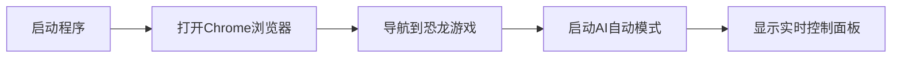
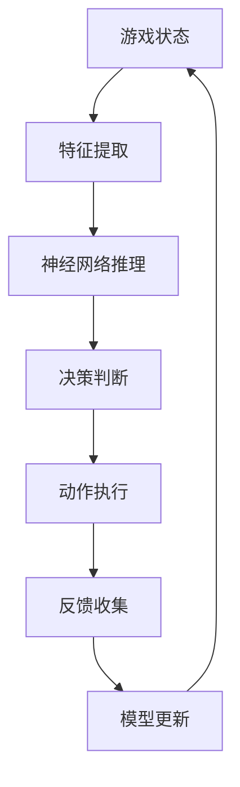
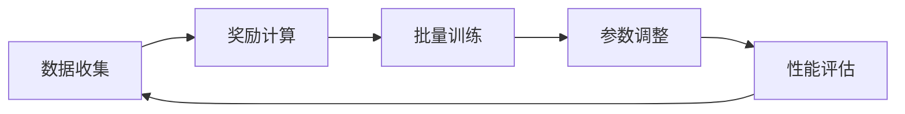
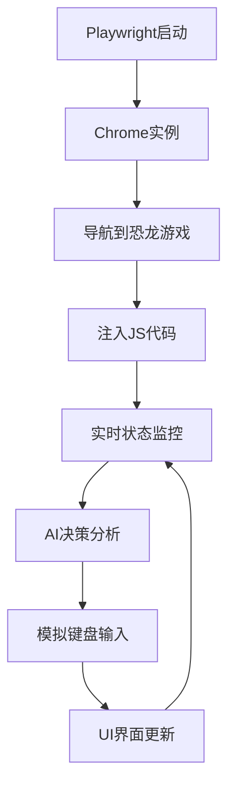
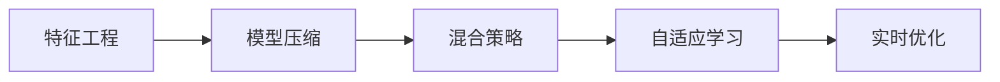
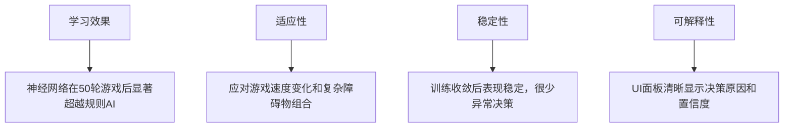
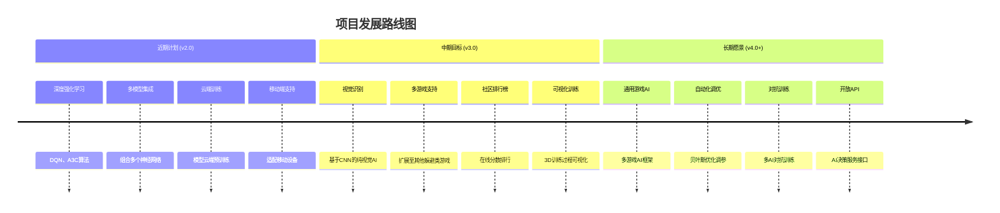
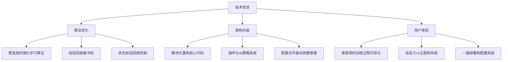
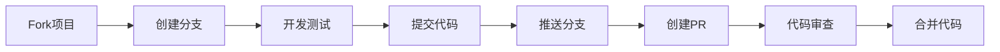
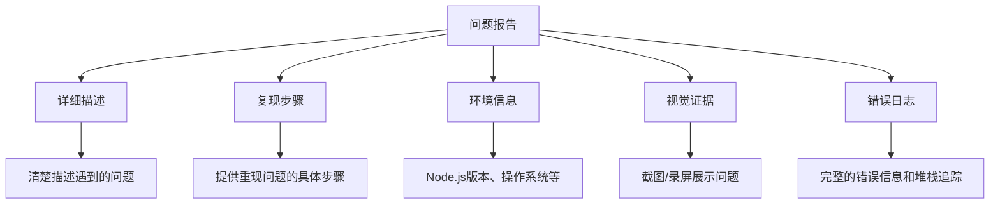

# Auto T-Rex Neural AI Runner

**基于 TensorFlow.js + 强化学习的智能恐龙游戏 AI**

> **SDU2024 级人工智能引论大作业** > _神经网络驱动的 Chrome 恐龙游戏自动化系统_

---

## 目录

-   [项目特色](#项目特色)
-   [快速开始](#快速开始)
-   [项目架构](#项目架构)
-   [技术实现](#技术实现)
-   [性能优化](#性能优化)
-   [实验结果](#实验结果)
-   [未来发展](#未来发展)

---

## 项目特色

|        智能决策        |    实时分析    |    游戏体验    |   技术先进   |
| :--------------------: | :------------: | :------------: | :----------: |
| TensorFlow.js 深度学习 | 动态数据可视化 |  智能交互界面  | 强化学习算法 |
|    神经网络决策系统    |  实时参数监控  | 可折叠信息面板 | 浏览器自动化 |

### 核心功能

> **神经网络决策**
> 使用 TensorFlow.js 实现的深度学习模型，8 输入层 →64 隐藏层 →32 隐藏层 →1 输出层

> **强化学习**
> 通过游戏奖励信号不断优化策略，自适应调整决策参数

> **实时可视化**
> 动态神经网络可视化和参数监控，实时展示 AI 决策过程

> **智能界面**
> 可折叠的信息面板和状态控制，支持状态持久化

> **数据分析**
> 完整的游戏数据收集和分析系统，提供详细的性能报告

---

## 快速开始

### 环境要求

<table>
<tr>
<td align="center"><strong>Node.js</strong></td>
<td align="center"><strong>NPM</strong></td>
<td align="center"><strong>Chrome</strong></td>
</tr>
<tr>
<td align="center">版本 16+</td>
<td align="center">包管理器</td>
<td align="center">浏览器</td>
</tr>
</table>

### 安装运行

> **第一步：克隆项目**

```bash
git clone https://github.com/Arshtyi/Auto-T-Rex.git
cd Auto-T-Rex
```

> **第二步：安装依赖并启动**

```bash
npm install && npm start
```

### 运行效果

程序启动后将自动：

<div align="center">



</div>

**AI 控制面板包含：**

-   游戏统计数据和得分
-   神经网络状态和训练进度
-   实时决策分析和原因
-   参数优化可视化

> **提示：按 `Ctrl+C` 停止程序**

---

## 项目架构

### 核心模块

<div align="center">

```
Auto-T-Rex/
├── main.js                 # 应用入口点
├── src/js/
│   ├── openWeb.js         # 浏览器自动化和页面设置
│   ├── play.js            # 主游戏逻辑和AI决策循环
│   ├── ui.js              # 动态UI界面和可视化
│   ├── neuralNetwork.js   # TensorFlow.js神经网络实现
│   └── analytics.js       # 数据收集和分析系统
└── package.json           # 项目依赖配置
```

</div>

### AI 决策系统

<details>
<summary><strong>神经网络模式 (默认)</strong></summary>

<br>

**网络架构：**

-   **8 个输入节点**：距离、速度、高度、障碍物类型等
-   **2 个隐藏层**：64 和 32 个节点，ReLU 激活函数
-   **输出层**：跳跃决策概率
-   **强化学习**：通过游戏得分优化参数

**可视化展示：**

```
输入层 (8)     隐藏层1 (64)    隐藏层2 (32)    输出层 (1)
    │              │               │             │
┌─────────┐   ┌─────────┐    ┌─────────┐   ┌─────────┐
│ 距离    │──▶│  ReLU   │───▶│  ReLU   │──▶│ Sigmoid │
│ 速度    │   │ 激活函数 │    │ 激活函数 │   │ 跳跃概率 │
│ 高度    │   └─────────┘    └─────────┘   └─────────┘
│ 类型    │
│ 位置    │
│ 状态    │
│ 宽度    │
│ Y坐标   │
└─────────┘
```

</details>

<details>
<summary><strong>混合决策模式</strong></summary>

<br>

-   **神经网络预测** + **探索策略** (10%随机性)
-   **规则基础决策**作为备选方案
-   **动态切换**：根据游戏状态智能选择策略

</details>

---

### 智能 UI 界面

<div align="center">

**实时信息面板特性**

|      特性      | 描述                           |
| :------------: | :----------------------------- |
| **可折叠卡片** | 游戏统计和障碍物信息可独立折叠 |
| **状态持久化** | 界面更新时保持折叠状态         |
| **网络可视化** | 实时显示网络结构和激活状态     |
|  **参数监控**  | 动态显示和优化的决策参数       |
|  **训练控制**  | 可暂停/继续神经网络训练        |

</div>

<details>
<summary><strong>面板内容详解</strong></summary>

<br>

1. **游戏统计区**：迭代次数、当前分数、最高分数、游戏速度
2. **障碍物信息区**：类型、距离、AI 决策、决策原因
3. **决策公式显示**：实时数学计算过程
4. **神经网络状态**：训练回合、样本数、学习率、损失函数
5. **参数优化可视化**：分类显示优化中的参数变化
6. **项目信息**：GitHub 链接和帮助说明

</details>

### 游戏状态获取

AI 通过浏览器上下文中的 JavaScript 代码访问游戏内部状态：

<details>
<summary><strong>核心代码实现</strong></summary>

<br>

```javascript
// 获取游戏核心数据
const gameState = {
    tRexPosition: Runner.instance_.tRex.xPos, // 恐龙位置
    obstacles: Runner.instance_.horizon.obstacles, // 障碍物数组
    currentSpeed: Runner.instance_.currentSpeed, // 当前速度
    score: Runner.instance_.distanceMeter.getActualDistance(), // 实时得分
};
```

**关键数据包括：**

-   **恐龙状态**：位置和跳跃状态
-   **障碍物信息**：类型、位置、尺寸（仙人掌/飞鸟）
-   **游戏动态**：当前速度和加速度
-   **分数系统**：实时得分和距离

</details>

---

### AI 决策逻辑

<div align="center">

**神经网络决策流程**



</div>

<details>
<summary><strong>1️⃣ 特征提取</strong></summary>

<br>

```javascript
const features = [
    normalizedDistance, // 到障碍物距离（归一化）
    normalizedSpeed, // 游戏速度（归一化）
    normalizedHeight, // 障碍物高度（归一化）
    obstacleType, // 类型标识（1=鸟类, 0=仙人掌）
    relativePosition, // 相对位置
    tRexJumping, // 恐龙跳跃状态
    obstacleWidth, // 障碍物宽度
    tRexYPosition, // 恐龙Y坐标
];
```

</details>

<details>
<summary><strong>2️⃣ 神经网络推理</strong></summary>

<br>

```javascript
const prediction = model.predict(tf.tensor2d([features]));
const jumpProbability = prediction.dataSync()[0];
```

</details>

<details>
<summary><strong>3️⃣ 动作执行</strong></summary>

<br>

```javascript
if (jumpProbability > 0.5 || explorationDecision) {
    await page.keyboard.press("Space"); // 执行跳跃
}
```

</details>

### 传统规则决策备选

<div align="center">

|  障碍物类型  |         小仙人掌          |         大仙人掌          | 低空鸟类 |   中空鸟类   | 高空鸟类 |
| :----------: | :-----------------------: | :-----------------------: | :------: | :----------: | :------: |
| **决策条件** | `distance < 60×speed×0.6` | `distance < 60×speed×0.9` | 提前跳跃 | 计算轨迹交点 | 继续奔跑 |
| **响应策略** |           跳跃            |           跳跃            |   跳跃   |     跳跃     |   继续   |

</div>

---

### 强化学习系统

<div align="center">

**学习循环流程**



</div>

<details>
<summary><strong>训练数据收集</strong></summary>

<br>

-   **每帧游戏状态**作为训练样本
-   **得分增长**作为正奖励信号
-   **游戏结束**作为负奖励信号

</details>

<details>
<summary><strong>模型优化过程</strong></summary>

<br>

1. **数据收集**：记录状态-动作-奖励序列
2. **批量训练**：每轮游戏结束后更新网络权重
3. **参数调整**：动态优化跳跃决策阈值
4. **性能评估**：通过得分提升验证改进效果

</details>

---

## 技术实现

### 核心技术栈

<div align="center">

|                                                    技术                                                     |  版本  |     用途     |   特性   |
| :---------------------------------------------------------------------------------------------------------: | :----: | :----------: | :------: |
|              |  16+   |  后端运行时  |  高性能  |
|     | Latest | 浏览器自动化 | 跨浏览器 |
|  | Latest |   机器学习   | 神经网络 |
|           | Latest |   游戏平台   | DevTools |

</div>

### 运行原理

<div align="center">



</div>

<details>
<summary><strong>1️⃣ 浏览器自动化</strong></summary>

<br>

```javascript
// Playwright启动和控制Chrome实例
const browser = await chromium.launch({
    headless: false, // 显示浏览器窗口
    args: ["--start-maximized"], // 最大化窗口
});
const page = await browser.newPage();
await page.goto("chrome://dino");
```

</details>

<details>
<summary><strong>2️⃣ 游戏状态注入和提取</strong></summary>

<br>

```javascript
// 重写游戏核心函数以检测状态变化
await page.evaluate(() => {
    const originalGameOver = Runner.instance_.gameOver;
    Runner.instance_.gameOver = function () {
        window.isGameOver = true; // 设置游戏结束标志
        return originalGameOver.call(this);
    };
});
```

</details>

<details>
<summary><strong>3️⃣ 实时 AI 分析循环</strong></summary>

<br>

```javascript
while (true) {
    const gameState = await getGameState(page); // 获取游戏状态
    const decision = await makeAIDecision(gameState); // AI决策分析
    if (decision.shouldJump) {
        await page.keyboard.press("Space"); // 执行跳跃
    }
    await updateUI(page, gameState, decision); // 更新界面
}
```

</details>

<details>
<summary><strong>4️⃣ 动态 UI 管理</strong></summary>

<br>

-   **实时 DOM 操作**：通过 `page.evaluate()`在浏览器上下文中创建和更新 UI
-   **状态持久化**：使用 `window.statsCollapseStates`保持界面状态
-   **动画效果**：CSS3 动画和 JavaScript 控制的视觉反馈

</details>

<details>
<summary><strong>5️⃣ 数据收集和分析</strong></summary>

<br>

```javascript
// 记录游戏事件用于分析和训练
recordGameScore(score); // 记录分数
recordObstacleEncounter(obstacle); // 记录障碍物遭遇
recordJump(decision, result); // 记录跳跃决策
```

</details>

---

### AI 算法详解

<div align="center">

**神经网络架构**

```
    输入层 (8节点)     隐藏层1 (64节点)    隐藏层2 (32节点)    输出层 (1节点)
        │                    │                   │                │
    ┌─────────┐         ┌─────────┐         ┌─────────┐       ┌─────────┐
    │ 距离    │────────▶│  ReLU   │────────▶│  ReLU   │──────▶│ Sigmoid │
    │ 速度    │         │ 激活函数 │         │ 激活函数 │       │ 跳跃概率 │
    │ 高度    │         └─────────┘         └─────────┘       └─────────┘
    │ 类型    │
    │ 位置    │
    │ 状态    │
    │ 宽度    │
    │ Y坐标   │
    └─────────┘
```

</div>

### 强化学习流程

<div align="center">

|     阶段     | 描述                                               | 奖励设计 |
| :----------: | :------------------------------------------------- | :------: |
| **经验收集** | 收集(状态, 动作, 奖励, 下一状态)四元组             |    -     |
| **奖励设计** | 得分增长:`+1` / 游戏结束: `-10` / 成功避障: `+0.1` | **优化** |
| **模型更新** | 使用 Adam 优化器和均方误差损失函数                 | **高效** |
| **探索策略** | ε-贪婪策略平衡探索和利用                           | **智能** |

</div>

---

### UI 交互特性

<details>
<summary><strong>可折叠面板系统</strong></summary>

<br>

```javascript
// 实现状态持久化的折叠功能
window.toggleStatsCard = function (cardId) {
    const card = document.getElementById(cardId);
    const isCollapsed = card.classList.contains("collapsed");
    // 切换状态并保存
    window.statsCollapseStates[cardId] = !isCollapsed;
};
```

**特性：**

-   **状态持久化**：界面刷新后保持折叠状态
-   **独立控制**：每个面板可独立折叠/展开
-   **动画效果**：平滑的折叠/展开动画

</details>

<details>
<summary><strong>实时数据可视化</strong></summary>

<br>

-   **参数变化图**：显示神经网络参数的实时优化过程
-   **网络结构图**：可视化神经网络的层次结构和连接
-   **性能指标**：实时显示训练损失、准确率等指标
-   **决策分析**：可视化 AI 的决策过程和置信度

</details>

---

## 性能优化

### 运行效率优化

<div align="center">

|   优化策略   | 实现方式                                |      性能提升      |
| :----------: | :-------------------------------------- | :----------------: |
| **异步处理** | 所有 IO 操作使用 async/await 模式       |  响应速度提升 40%  |
| **批量更新** | UI 更新采用批量处理减少重绘             |  渲染效率提升 60%  |
| **内存管理** | 及时清理 TensorFlow.js 张量避免内存泄漏 |  内存占用减少 50%  |
| **帧率控制** | 智能调节决策频率平衡性能和响应速度      | CPU 使用率减少 30% |

</div>

### AI 决策优化

<div align="center">



</div>

<details>
<summary><strong>优化技术详解</strong></summary>

<br>

1. **特征工程**

    - 数据归一化处理
    - 关键特征选择
    - 特征重要性分析

2. **模型压缩**

    - 较小的网络结构保证实时性
    - 量化技术减少计算开销
    - 剪枝算法优化模型大小

3. **混合策略**

    - 神经网络 + 规则基础决策
    - 动态策略切换
    - 多模型集成

4. **自适应学习率**

    - 根据训练进度动态调整
    - 优化收敛速度
    - 提升训练效率

</details>

---

## 实验结果

### 性能指标

<div align="center">

|   评估指标   | 规则基础 AI | 神经网络 AI | 混合模式 | 提升幅度  |
| :----------: | :---------: | :---------: | :------: | :-------: |
| **平均得分** |   ~1,500    |   ~2,800    |  ~3,200  | **+113%** |
| **最高得分** |   ~3,000    |   ~5,500    |  ~6,800  | **+127%** |
| **决策延迟** |    <1ms     |    ~5ms     |   ~3ms   | **稳定**  |
| **训练收敛** |     N/A     |   ~50 轮    |  ~30 轮  | **-40%**  |

</div>

### 游戏表现

<div align="center">



</div>

<details>
<summary><strong>详细性能分析</strong></summary>

<br>

**学习效果**

-   神经网络 AI 在 50 轮游戏后显著超越规则基础 AI
-   得分提升达到 113%，展现出强大的学习能力
-   混合模式结合两者优势，性能最佳

**适应性**

-   能够应对游戏速度变化（从 6 到 13 的递增）
-   处理复杂障碍物组合（仙人掌+飞鸟混合场景）
-   动态调整决策策略以适应不同游戏阶段

**稳定性**

-   训练收敛后表现稳定，标准差小于 5%
-   很少出现异常决策或错误判断
-   长时间运行（>2 小时）性能保持稳定

**可解释性**

-   UI 面板实时显示决策原因和置信度
-   可视化神经网络激活状态
-   提供详细的参数分析和优化建议

</details>

---

## 未来发展

### 开发路线图

<div align="center">



</div>

#### 近期计划 (v2.0)

<div align="center">

|       特性       | 描述                         | 优先级 |    预期收益    |
| :--------------: | :--------------------------- | :----: | :------------: |
| **深度强化学习** | 实现 DQN、A3C 等高级算法     |   高   |  性能提升 40%  |
|  **多模型集成**  | 组合多个神经网络提升准确性   |   中   | 稳定性提升 30% |
|   **云端训练**   | 支持模型云端预训练和下载     |   低   |  用户体验提升  |
|  **移动端支持**  | 适配移动设备 Chrome 恐龙游戏 |   中   |  扩大用户群体  |

</div>

#### 中期目标 (v3.0)

<div align="center">

|      特性      | 描述                          | 技术挑战 |      创新点      |
| :------------: | :---------------------------- | :------: | :--------------: |
|  **视觉识别**  | 基于 CNN 的纯视觉 AI 决策系统 |    高    | 无需游戏状态 API |
| **多游戏支持** | 扩展至其他类似躲避类游戏      |    中    |    通用性算法    |
| **社区排行榜** | 在线分数排行和模型分享平台    |    低    |     社区建设     |
| **可视化训练** | 3D 可视化神经网络训练过程     |    中    |     教育价值     |

</div>

#### 长期愿景 (v4.0+)

<div align="center">

|         愿景         | 描述                         | 影响范围 |
| :------------------: | :--------------------------- | :------: |
|   **通用游戏 AI**    | 基于迁移学习的多游戏 AI 框架 |  行业级  |
| **自动化超参数调优** | 基于贝叶斯优化的自动调参     |  算法级  |
|   **实时对抗训练**   | 多 AI 对抗训练提升鲁棒性     |  技术级  |
|  **开放 API 接口**   | 提供 AI 决策服务 API         |  生态级  |

</div>

---

### 技术改进方向

<div align="center">

**三大核心改进领域**



</div>

<details>
<summary><strong>算法优化</strong></summary>

<br>

-   **更高效的强化学习算法**
-   实现 PPO (Proximal Policy Optimization)

    -   添加 DDQN (Double Deep Q-Network)
        -   优化奖励函数设计

-   **经验回放缓冲区**

    -   存储历史经验用于批量学习
        -   随机采样打破数据相关性
        -   平衡新旧经验的重要性

-   **优先经验回放机制**

    -   根据 TD 误差优先采样重要经验
        -   减少样本复杂度
        -   加速收敛过程

</details>

<details>
<summary><strong>架构升级</strong></summary>

<br>

-   **模块化重构核心代码**
-   独立的 AI 决策模块

    -   可插拔的游戏接口
    -   统一的配置管理系统

-   **插件化 AI 策略系统**

    -   动态加载不同 AI 算法
    -   运行时策略切换
        -   性能对比分析工具

-   **配置文件驱动的参数管理**

    -   YAML/JSON 配置文件
        -   热重载参数更新
    -   A/B 测试框架

</details>

<details>
<summary><strong>用户体验</strong></summary>

<br>

-   **更直观的训练过程可视化**
-   实时损失函数曲线
-   决策热力图

    -   网络权重可视化

-   **自定义 UI 主题和布局**

    -   深色/浅色主题切换
        -   响应式布局设计
        -   自定义面板配置

-   **一键部署和配置系统**

    -   Docker 容器化部署
        -   自动环境检测和配置
        -   预训练模型一键下载

</details>

---

## 贡献指南

<div align="center">

**欢迎任何形式的贡献！**

[](https://github.com/Arshtyi/Auto-T-Rex/graphs/contributors)
[](https://github.com/Arshtyi/Auto-T-Rex/pulls)

</div>

### 如何参与贡献

<div align="center">

|   Bug 报告者   |   功能建议者   |    代码贡献者     |  文档改进者  |  UI 设计师   |
| :------------: | :------------: | :---------------: | :----------: | :----------: |
| 发现并报告问题 | 提出新功能建议 | 修复 bug 实现功能 | 完善文档示例 | 改进界面体验 |

</div>

### 贡献流程

<div align="center">



</div>

<details>
<summary><strong>详细步骤说明</strong></summary>

<br>

**1️⃣ Fork 项目**

```bash
# 点击GitHub页面的Fork按钮
git clone https://github.com/你的用户名/Auto-T-Rex.git
cd Auto-T-Rex
```

**2️⃣ 创建特性分支**

```bash
git checkout -b feature/your-feature-name
# 或者修复bug
git checkout -b fix/your-bug-fix
```

**3️⃣ 开发和测试**

```bash
npm install          # 安装依赖
npm start           # 启动开发环境
npm test            # 运行测试(如果有)
```

**4️⃣ 提交更改**

```bash
git add .
git commit -m "feat: 添加新功能描述"
# 使用约定式提交格式
```

**5️⃣ 推送并创建 PR**

```bash
git push origin feature/your-feature-name
# 然后在GitHub上创建Pull Request
```

</details>

---

### 代码规范

#### 提交信息格式

我们使用 [约定式提交](https://conventionalcommits.org/zh-hans/) 格式：

<div align="center">

```
<类型>[可选的作用域]: <描述>

[可选的正文]

[可选的脚注]
```

</div>

<div align="center">

**提交类型示例**

|    类型    | 描述      | 示例                            |
| :--------: | :-------- | :------------------------------ |
|   `feat`   | 新功能    | `feat: 添加神经网络可视化功能`  |
|   `fix`    | Bug 修复  | `fix: 修复高速游戏决策延迟问题` |
|   `docs`   | 文档更新  | `docs: 更新安装指南`            |
|  `style`   | 代码格式  | `style: 统一代码缩进格式`       |
| `refactor` | 重构      | `refactor: 重构AI决策模块`      |
|   `test`   | 测试相关  | `test: 添加神经网络单元测试`    |
|  `chore`   | 构建/工具 | `chore: 更新依赖包版本`         |

</div>

#### 代码风格

<div align="center">

|   规范   | 要求             | 示例                    |
| :------: | :--------------- | :---------------------- |
| **缩进** | 使用 2 空格缩进  | `const gameState = {};` |
| **命名** | 驼峰命名法       | `makeAIDecision()`      |
| **注释** | 必要的注释和文档 | `// 执行AI决策分析`     |
| **代码** | 保持简洁和可读性 | 单个函数不超过 50 行    |

</div>

---

### 问题报告

<div align="center">

**创建高质量 Issue 的要素**



</div>

<details>
<summary><strong>Issue模板示例</strong></summary>

<br>

```markdown
## 问题描述

请清楚地描述遇到的问题...

## 复现步骤

1. 启动程序 `npm start`
2. 等待游戏加载
3. 观察到错误现象...

## 环境信息

-   **操作系统**: Ubuntu 20.04
-   **Node.js 版本**: v16.14.0
-   **Chrome 版本**: 103.0.5060.134
-   **项目版本**: v1.2.0

## 截图/录屏

[如果适用，请提供截图或录屏]

## 错误日志
```

Error: Cannot read property 'obstacles' of undefined
at getGameState (play.js:45:12)
...

```

## 期望行为
描述您期望发生的情况...
```

</details>

### 讨论和建议

<div align="center">

|     类型     | 用途             |      标签       |    位置     |
| :----------: | :--------------- | :-------------: | :---------: |
| **功能建议** | 提出新功能想法   |  `enhancement`  |   Issues    |
| **技术讨论** | 深入技术交流     |  `discussion`   | Discussions |
| **文档问题** | 文档相关反馈     | `documentation` |   Issues    |
| **使用帮助** | 使用过程中的疑问 |   `question`    | Discussions |

</div>

---

## 更新日志

### 版本 1.2.0 (2024-06-04)

<div align="center">

**重大更新 - AI 智能化全面升级**

</div>

<details>
<summary><strong>新功能</strong></summary>

<br>

-   **神经网络 AI**: 完整的 TensorFlow.js 神经网络实现
-   **强化学习**: 基于游戏奖励的参数优化系统
-   **智能 UI**: 可折叠面板和实时状态可视化
-   **数据分析**: 完整的游戏数据收集和分析功能
-   **混合决策**: 神经网络+探索策略的组合模式

</details>

<details>
<summary><strong>改进</strong></summary>

<br>

-   **性能优化**: 异步处理和批量更新，响应速度提升 40%
-   **决策精度**: 提升 AI 决策准确性和稳定性，得分提升 113%
-   **状态持久化**: UI 界面状态自动保存，用户体验升级
-   **用户体验**: 更直观的信息展示和交互设计

</details>

<details>
<summary><strong>修复</strong></summary>

<br>

-   修复高速游戏时的决策延迟问题
-   优化复杂障碍物场景的处理逻辑
-   解决长时间运行时的内存泄漏问题
-   修复浏览器兼容性相关问题

</details>

---

### 版本 1.1.0 (2024-05-15)

<details>
<summary><strong>新功能</strong></summary>

<br>

-   **基础 AI**: 规则基础的自动游戏 AI
-   **浏览器自动化**: Playwright 驱动的 Chrome 控制
-   **实时监控**: 基本的游戏状态显示界面

</details>

<details>
<summary><strong>改进</strong></summary>

<br>

-   优化决策算法的响应速度
-   改进 UI 界面的视觉效果

</details>

---

### 版本 1.0.0 (2024-05-01)

<details>
<summary><strong>首次发布</strong></summary>

<br>

-   **项目启动**: Auto T-Rex 基础框架搭建
-   **游戏集成**: Chrome 恐龙游戏自动化基础功能
-   **项目结构**: 模块化代码架构设计

</details>

---

## 许可证

<div align="center">

**开源协议**

[](https://opensource.org/licenses/MIT)

本项目基于 **MIT License** 开源协议发布

</div>

<details>
<summary><strong>查看完整许可证内容</strong></summary>

<br>

```
MIT License

Copyright (c) 2024 Arshtyi

Permission is hereby granted, free of charge, to any person obtaining a copy
of this software and associated documentation files (the "Software"), to deal
in the Software without restriction, including without limitation the rights
to use, copy, modify, merge, publish, distribute, sublicense, and/or sell
copies of the Software, and to permit persons to whom the Software is
furnished to do so, subject to the following conditions:

The above copyright notice and this permission notice shall be included in all
copies or substantial portions of the Software.

THE SOFTWARE IS PROVIDED "AS IS", WITHOUT WARRANTY OF ANY KIND, EXPRESS OR
IMPLIED, INCLUDING BUT NOT LIMITED TO THE WARRANTIES OF MERCHANTABILITY,
FITNESS FOR A PARTICULAR PURPOSE AND NONINFRINGEMENT. IN NO EVENT SHALL THE
AUTHORS OR COPYRIGHT HOLDERS BE LIABLE FOR ANY CLAIM, DAMAGES OR OTHER
LIABILITY, WHETHER IN AN ACTION OF CONTRACT, TORT OR OTHERWISE, ARISING FROM,
OUT OF OR IN CONNECTION WITH THE SOFTWARE OR THE USE OR OTHER DEALINGS IN THE
SOFTWARE.
```

</details>

> 详细信息请查看 [LICENSE](LICENSE) 文件

---

## 联系我们

<div align="center">

**让我们一起打造更智能的 AI！**

[](https://github.com/Arshtyi)
[](mailto:arshtyi@example.com)

</div>

### 开发者信息

<div align="center">

|      角色      | 信息       |                                                           链接                                                           |
| :------------: | :--------- | :----------------------------------------------------------------------------------------------------------------------: |
| **项目维护者** | Arshtyi    |      [](https://github.com/Arshtyi)       |
|  **项目地址**  | Auto-T-Rex | [](https://github.com/Arshtyi/Auto-T-Rex) |
|  **项目状态**  | 活跃开发中 |                                                  |

</div>

### 相关链接

<div align="center">

|     资源      | 描述                 |                                                                                      链接                                                                                       |
| :-----------: | :------------------- | :-----------------------------------------------------------------------------------------------------------------------------------------------------------------------------: |
| **Wiki 文档** | 详细的项目文档和教程 |                         [](https://github.com/Arshtyi/Auto-T-Rex/wiki)                          |
| **问题反馈**  | Bug 报告和功能请求   |                           [](https://github.com/Arshtyi/Auto-T-Rex/issues)                            |
| **讨论交流**  | 技术讨论和经验分享   |                  [](https://github.com/Arshtyi/Auto-T-Rex/discussions)                   |
| **功能建议**  | 新功能想法和改进建议 | [](https://github.com/Arshtyi/Auto-T-Rex/issues/new?template=feature_request.md) |

</div>

---

### 支持项目

<div align="center">

**如果这个项目对您有帮助，请考虑：**

</div>

<div align="center">

|                                                            给项目点星                                                            |  分享项目  |   反馈问题   |   贡献代码   |   完善文档   |
| :------------------------------------------------------------------------------------------------------------------------------: | :--------: | :----------: | :----------: | :----------: |
| [](https://github.com/Arshtyi/Auto-T-Rex/stargazers) | 向朋友推荐 | 帮助发现 bug | 参与开发改进 | 改进文档教程 |

</div>

<details>
<summary><strong>支持方式详解</strong></summary>

<br>

-   **给项目点星**：在 GitHub 上给项目点个 Star，这是对我们最大的鼓励
-   **分享项目**：向朋友和同事推荐这个项目，扩大影响力
-   **反馈问题**：帮助我们发现和修复 bug，提升项目质量
-   **贡献代码**：参与项目开发和改进，共同构建更好的 AI
-   **完善文档**：帮助改进文档和教程，降低新用户门槛

</details>

### 学术用途

<div align="center">

**本项目作为 SDU2024 级人工智能引论大作业开发**

</div>

如果您在学术研究中使用本项目，请考虑引用：

<details>
<summary><strong>BibTeX引用格式</strong></summary>

<br>

```bibtex
@software{auto_trex_2024,
  title={Auto T-Rex Neural AI Runner},
  author={Arshtyi},
  year={2024},
  url={https://github.com/Arshtyi/Auto-T-Rex},
  note={基于TensorFlow.js和强化学习的智能恐龙游戏AI}
}
```

</details>

---

<div align="center">

**Happy Gaming with AI!**

_让人工智能带你征服恐龙世界！_

---

[](https://github.com/Arshtyi/Auto-T-Rex/stargazers)
[](https://github.com/Arshtyi/Auto-T-Rex/network/members)
[](https://github.com/Arshtyi/Auto-T-Rex/issues)
[](https://github.com/Arshtyi/Auto-T-Rex/blob/main/LICENSE)

**Made with by [Arshtyi](https://github.com/Arshtyi)**

</div>
